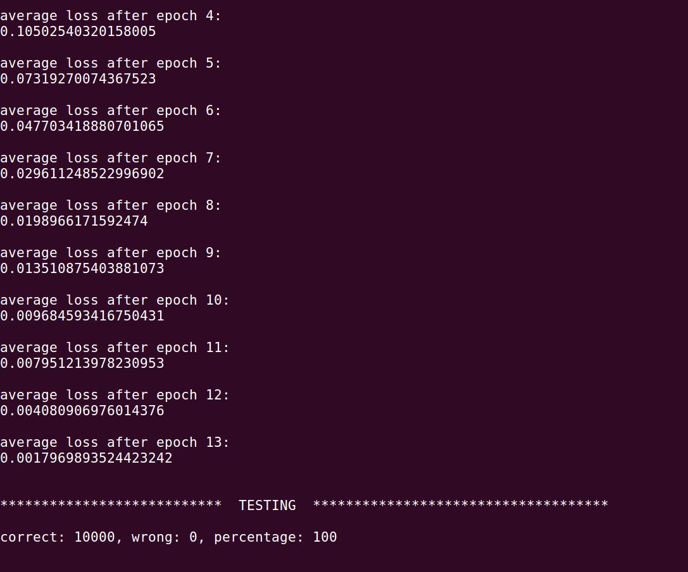

# mnist 10k

This is a micro-framework for neural nets (dense, recurrent, conv) written from base matrix operations using tensorflow.  

97% prediction of 10K mnist samples may be attained with this example, which uses a relatively small network (see below)

100% overfitting also possible AMA

* [install](#install)
* [network](#network)
* [notes](#notes)

# install
clone repo, and `npm i` to install dependencies;  you also need `>CUDA 9.1`

then run `node app.js`

# network

batch size: 56

epochs: 13

train set: 10k samples

test set: 10k samples

input: [28,28] single dimension pixel image as (batch, 784)

conv layers: [3,3,10] > relu > [1,1,1] > relu

dense encode layers: [, 256] > tanh > [,10] > (linear)

loss: mean(softmaxCrossEntropy(x, y))

train: adam(rate=.0061)

# notes

only core tensorflow operations are used, no layers or frameworks (the work in progress is a kind of framework) 

no pooling, dropout, batch norm, nor regularization of weights

`data.js`, which handles the pipeline, is from [@tensorflow/tfjs-examples](https://github.com/tensorflow/tfjs-examples/blob/master/mnist-node/data.js)

